# Skylogr

**Offline-first flight logbook for professional drone pilots.**

Skylogr imports flight logs from DJI, ArduPilot, and MAVLink-based aircraft, organizes them by drone, and gives you a clean dashboard of your flight hours, fleet, and pilot stats — all stored locally on your own computer. No subscriptions, no cloud, no internet required after setup.

---

## Screenshots

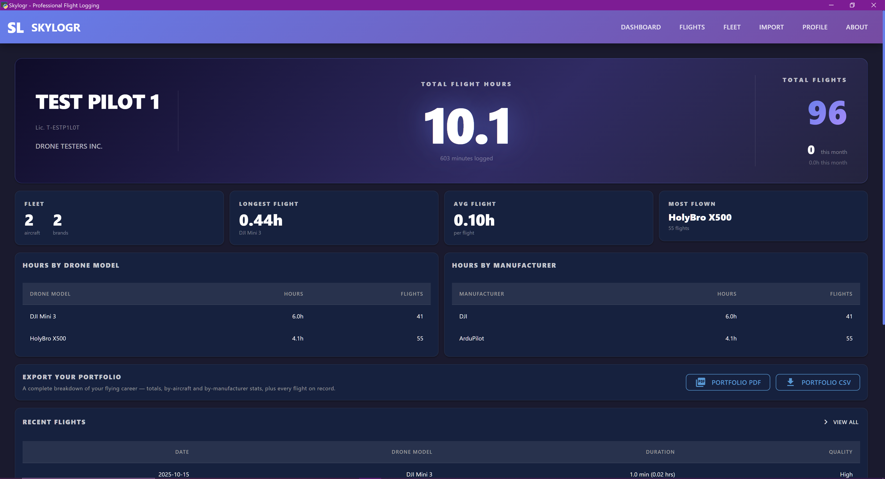
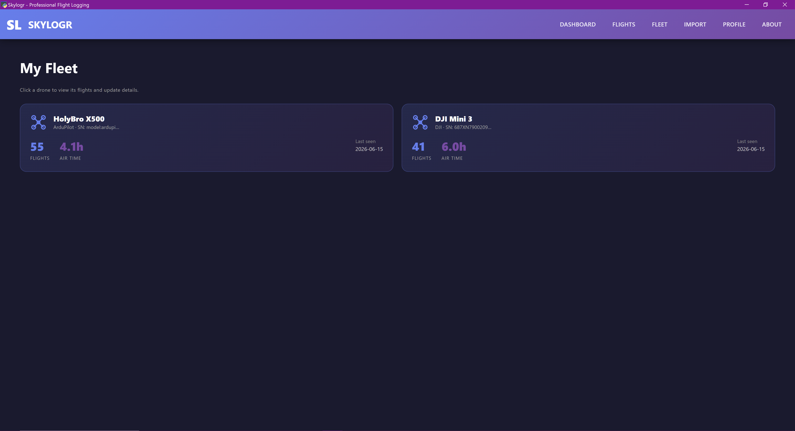
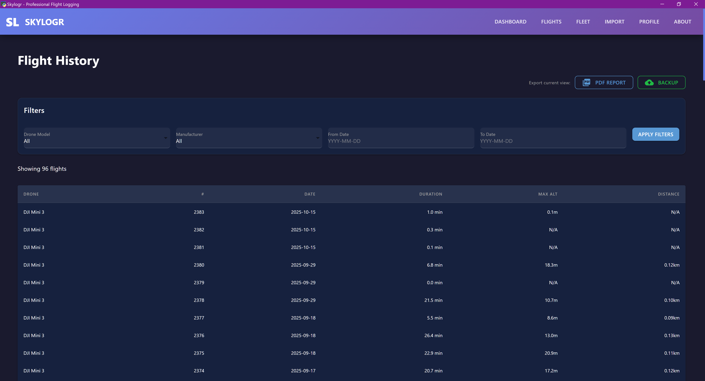
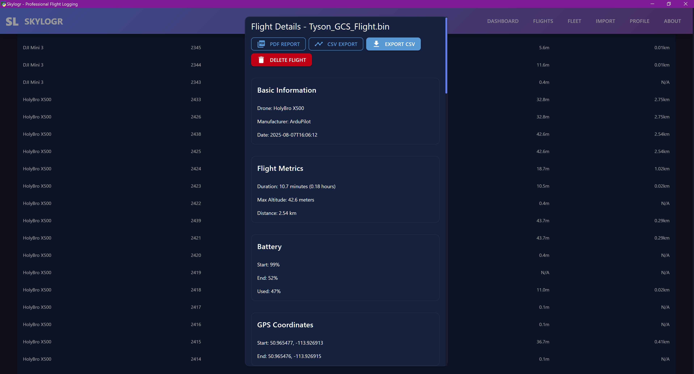
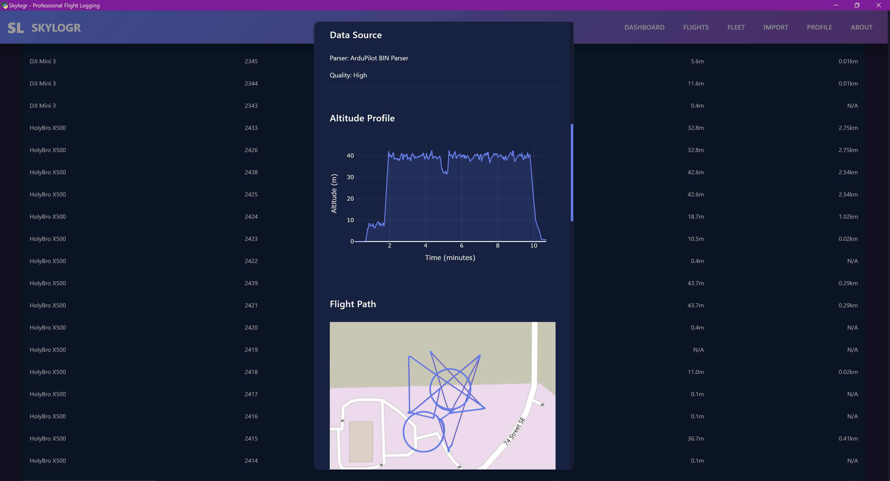
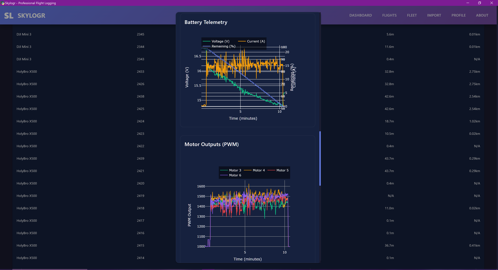
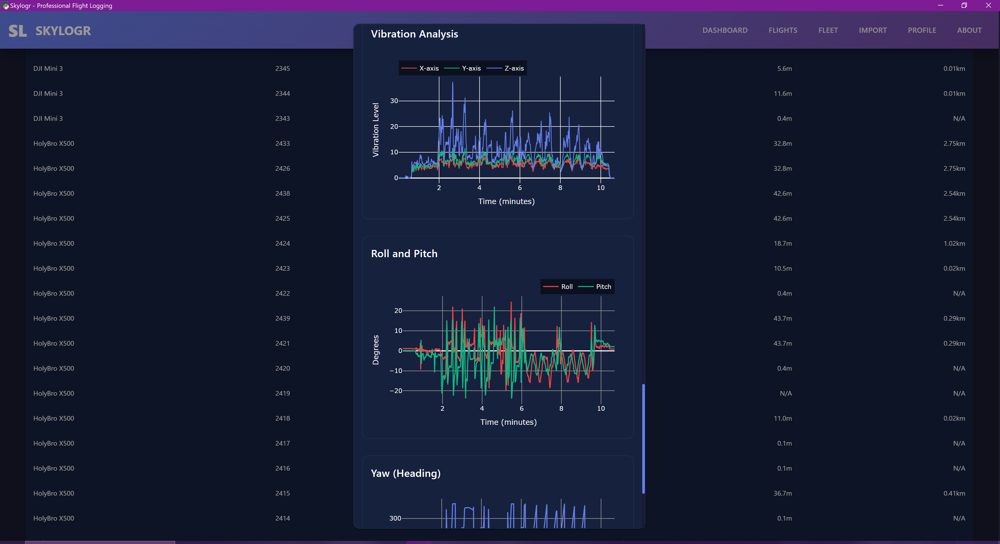
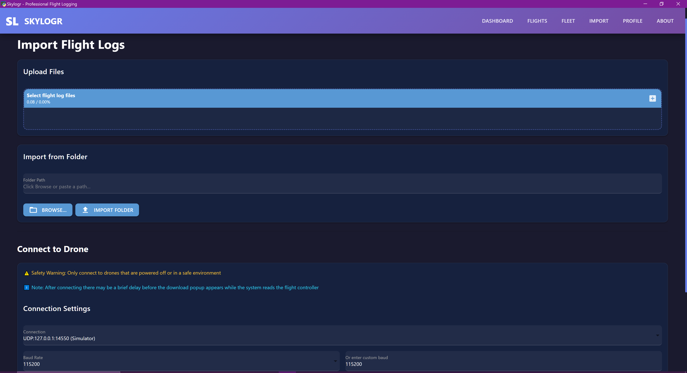
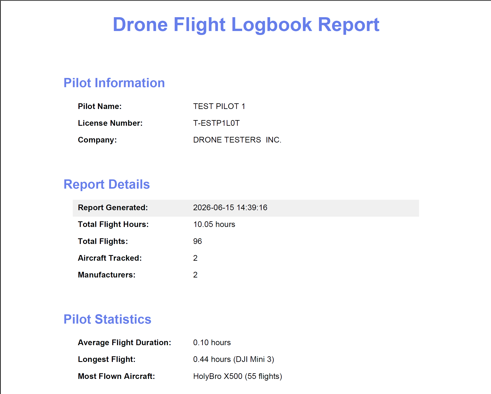
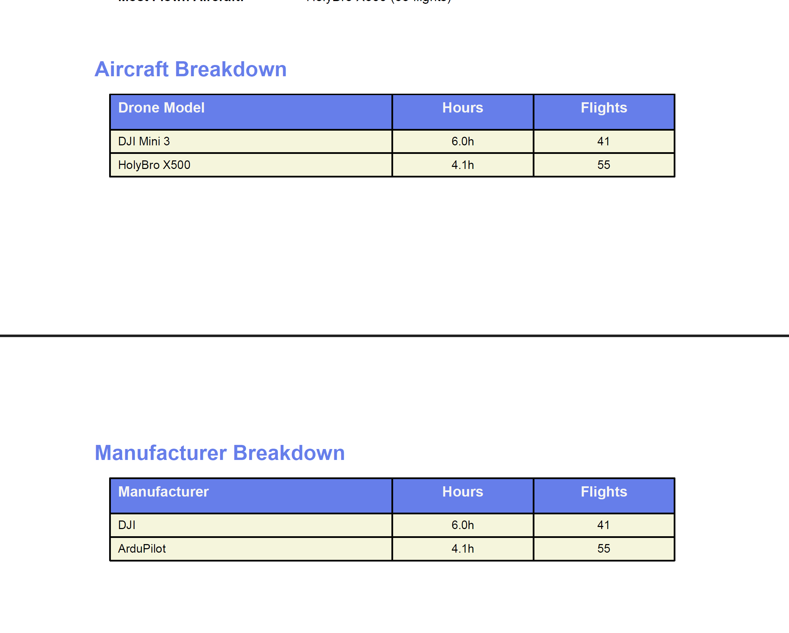
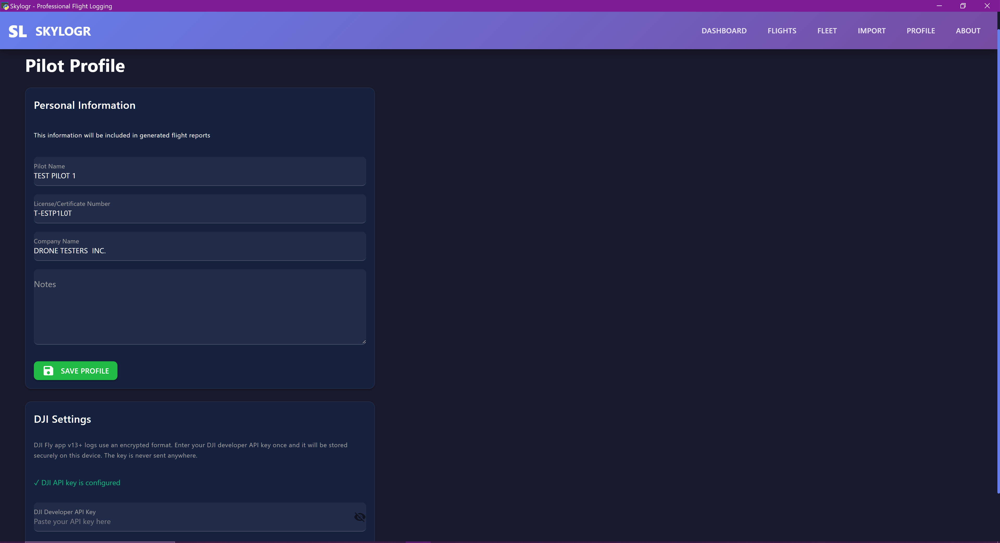

---

## Features

- **Local-first & Private** — your flights are stored in a database on your own computer, never uploaded anywhere
- **Multi-Format Log Import** — supports:
  - DJI Fly app logs (`.txt`) — full GPS, altitude, speed, and battery telemetry
  - ArduPilot dataflash logs (`.bin`)
  - MAVLink telemetry logs (`.tlog` / `.rlog`)
  - Airdata UAV CSV exports (`.csv`)
  - Legacy DJI `.DAT` logs
- **Direct Drone Connection** — connect over USB/serial and download logs straight from the flight controller
- **Fleet Management** — every aircraft is recognized automatically; give it a nickname, owner, and registration number, and it keeps its full flight history
- **Professional Dashboard** — total flight hours, hours by drone and manufacturer, and pilot stats at a glance
- **Detailed Flight Analysis** — altitude, speed, battery, and GPS track playback for every individual flight
- **Enhanced DJI Logs** — re-process DJI Fly logs with the bundled, MIT-licensed `dji-log-parser` for fully accurate GPS, altitude, speed, and battery data (uses your DJI account API key, stored encrypted)
- **PDF Report Generation** — produce client-ready flight reports in one click
- **CSV Export & One-Click Backup** — export your logbook to CSV, or back up your entire database, uploads, and settings at any time
- **Pilot Profile** — store your name, license/certificate number, and company details for use on generated reports

---

## Requirements

- Windows 10 or 11
- Internet connection for the one-time setup only (Skylogr runs fully offline afterward)

You do **not** need to have Python installed — the setup script will install it for you if it's missing.

---

## Installation

1. **Download** this repository (click the green **Code** button → **Download ZIP**, then extract it) or download the latest [Release](../../releases) ZIP.
2. Open the extracted folder.
3. Double-click **`SETUP.bat`**.

That's it. The setup script will:
1. Check for Python and install it automatically if needed
2. Install all required packages
3. Create a **Skylogr** shortcut on your Desktop

When setup finishes, you can launch Skylogr any time from the Desktop shortcut, or by double-clicking **`START.bat`**.

> First launch may take a few extra seconds while the app initializes its local database.

---

## Using Skylogr

### Import flights
Go to the **Import** page and drag in your log files (or a whole folder of them). Skylogr auto-detects the format and parses each file. For DJI Fly logs, entering your DJI account API key (Import page) unlocks fully accurate GPS, altitude, speed, and battery data — the key is stored encrypted on your computer and is never sent anywhere else.

### Fleet
The **Fleet** page lists every aircraft Skylogr has seen, grouped by serial number. Click an aircraft to give it a nickname, owner, and registration, and to see its full flight history and total hours.

### Dashboard
The **Dashboard** shows your total flight hours, flight count, hours broken down by drone and manufacturer, and your most recent flights.

### Flight details
Click any flight to see a full breakdown — altitude, speed, battery, and GPS track over time — and to generate a PDF report or export to CSV.

### Connect a drone directly
The **Connect** page lets you plug in a flight controller over USB and download logs directly, without manually copying files off an SD card.

### Backups
From the **About** page you can create a one-click backup of your entire database, uploads, and settings, or restore from a previous backup.

---

## Your Data

All flight data lives in a local SQLite database on your computer — nothing is ever uploaded to a server. We strongly recommend using the built-in **Backup** feature periodically to protect your flight history.

---

## Credits

- Built with [NiceGUI](https://nicegui.io/)
- DJI log enhancement powered by [dji-log-parser](https://github.com/lvauvillier/dji-log-parser) (MIT License), bundled as `backend/_dji_bin/dji-log.exe`
- ArduPilot/MAVLink parsing via [pymavlink](https://github.com/ArduPilot/pymavlink) (LGPL)

---

## License

See [LICENSE.txt](LICENSE.txt). Skylogr is free to use and share for personal or commercial flight logging. Please don't resell it as your own product or remove attribution.

---

**Built for professional pilots who need reliable, offline flight hour tracking.**
